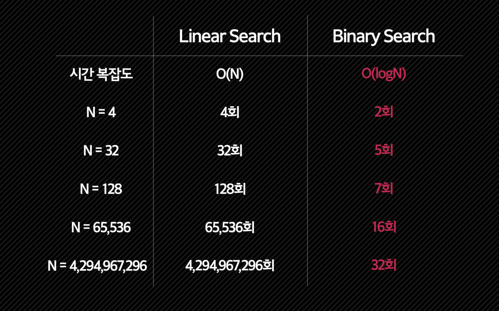

## 이분 탐색이란?

- 데이터가 **정렬돼 있는 배열**에서 특정한 값을 찾아내는 알고리즘
- 탐색을 진행할 때마다 탐색의 범위를 반으로 줄임
- 데이터 삽입이나 삭제에는 유리하지 않고, 주로 고정된 데이터에 대한 탐색에 유리

## 이분 탐색을 사용하는 이유

- 순차 탐색에 비해 **엄청난 성능 차이**
  

- 시간 복잡도 - **O(logN)**
  

## 이분 탐색 구현

### 동작 원리

- 우선 정렬을 해야 함
- left와 right로 mid 값 설정
- mid와 내가 구하고자 하는 값과 비교
- 구할 값이 mid보다 높으면 : left = mid+1 구할 값이 mid보다 낮으면 : right = mid - 1
- left > right가 될 때까지 계속 반복하기

### 소스 코드 (Python)

```python
def BinarySearch(arr, target):
    left = 0
    right = len(arr) - 1

    while left < right:
        mid = (left + right) // 2
        if arr[mid] < target:
            left = mid + 1
        else:
            right = mid
    return (left + right) / 2
```

```toc

```
