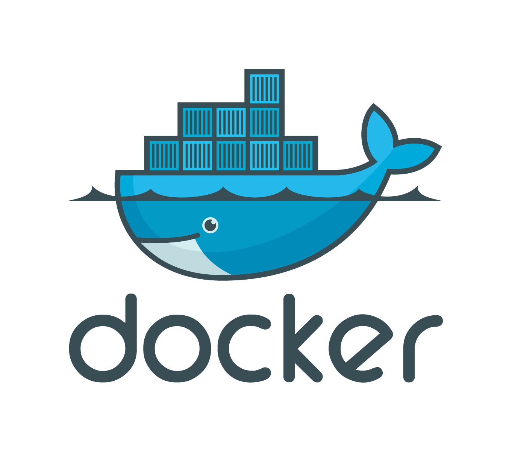
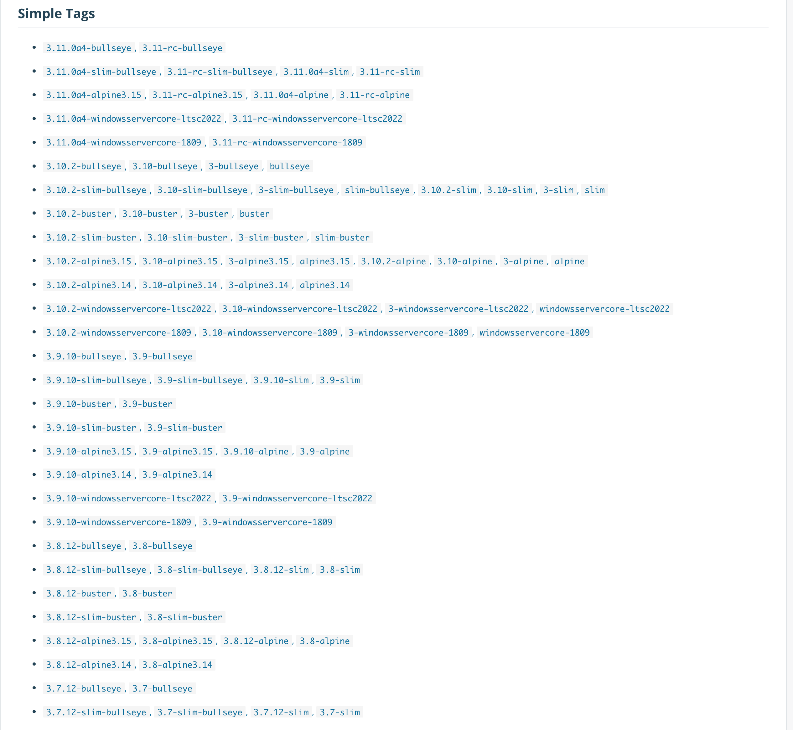

## Docker image 종류?

처음 Docker를 접하고 Docker Hub에서 이미지를 받으려고 한다면 수십가지의 docker 이미지로 인해 선택장애를 일으킬 확률이 매우 높다.



위의 사진은 Python 이미지를 받기 위해 Docker Hub에 들어가면 만나게 되는 장면이다. 숫자는 Python 버전을 의미하는 것 같은데 뒤에 붙은 단어들은 도대체 뭘 의미하는 걸까? 이 많은 것들 중에 어떤 이미지를 선택해서 써야할까? 이러한 궁금증을 같이 풀어보도록 하자.

<br>

---

## 이미지 종류

- Full official image
- stretch/buster/jessie/bullseye
- slim
- alpine
- windowsservercore

### Full official image

> name:version

기본적으로 Docker는 name:version에 해당하는 버전을 사용한다. (Base 이미지)
해당 버전의 이미지는 가장 최근의 안정적인 데비안 운영 체제 릴리스를 기반으로 한다.

가장 안정적이기 때문에 만약 프로젝트가 이미지의 용량에 구애받지 않고 빠르게 구현하는 것에 초점을 두는 상태라면 사용하기 가장 좋은 이미지이다.

### stretch/buster/jessie/bullseye

> name:version-<span style="color:red">stretch</span>, name:version-<span style="color:red">buster</span>, name:version-<span style="color:red">jessie</span>, name:version-<span style="color:red">bullseye</span>

stretch, buster, jessie, bullseye 태그가 붙은 이미지의 경우 데비안 릴리스의 코드명을 의미한다.
데비안 버전은 숫자로 8, 9, 10, 11로 표기를 하기도 하지만 jessie(8), stretch(9), buster(10), bullseye(11)과 같이 코드명으로 표기하기도 한다. 현재 Stable(안정화) 배포판은 Buster이다.

일반적으로 안정화 버전을 사용하면 되고 만약에 새로운 프로젝트가 이전 버전의 데비안 버전이 필요하다면 선택해서 사용하면 된다.

### slim

> name:version-<span style="color:red">slim</span>

Silm은 실행하기 위한 최소한의 패키지만 설치된 이미지이다.
Full official image에서 최소한의 라이브러리나 패키지만 남기고 나머지를 지운 다운된 버전이라고 생각하면 된다.

용량 이슈가 있고 Full 이미지 버전이 필요없을 때 slim 이미지를 사용한다.

### apline

> name:version-<span style="color:red">alpine</span>

Alpine 이미지는 컨테이너 내부에서 사용하기 위해 특별히 제작된 운영 체제인 <span style="color:red">알파인 리눅스 프로젝트</span>를 기반으로 한다.
가장 용량이 작고 가벼운 이미지이다.

용량 이슈가 클 때 사용하기에 추천되는 이미지이다.

### windowsservercore

> name:version-<span style="color:red">windowsservercore</span>

Windows Server 기반으로 작성된 이미지이다.

<br>

---

## 이미지 선택 기준

그래... 이미지 종류가 저렇게 있다는 건 알겠어. 그래서 어떤 이미지를 선택하라고....??

- 빠르게 구현을 해야하고 용량 제한이 없고 테스트할 시간이 많지 않을 때 - <span style="color:red">Full official image</span>
- 용량 걱정이 되고 최소한의 패키지만 필요로 할 때 - <span style="color:red">Slim</span>
- 꼼꼼하게 테스트 해볼 시간이 있고 용량 제한이 심한 프로젝트 일 때 - <span style="color:red">Apline</span>

<br>

---

## 참고자료

[https://no-easy-dev.tistory.com/entry/Docker-Docker-Image-Differences](https://no-easy-dev.tistory.com/entry/Docker-Docker-Image-Differences)
[https://medium.com/swlh/alpine-slim-stretch-buster-jessie-bullseye-bookworm-what-are-the-differences-in-docker-62171ed4531d](https://medium.com/swlh/alpine-slim-stretch-buster-jessie-bullseye-bookworm-what-are-the-differences-in-docker-62171ed4531d)

```toc

```
