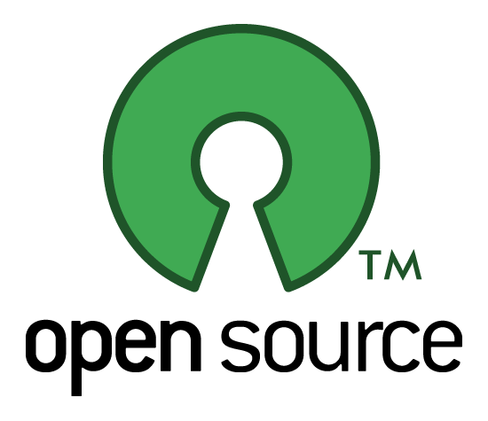
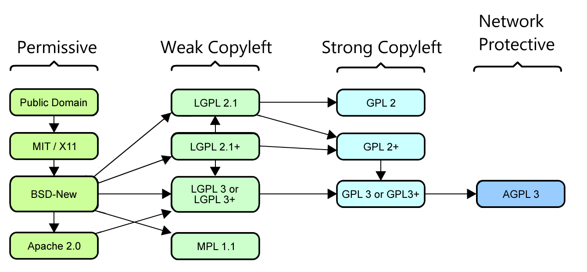

## 이야기의 시작

입사하고 처음으로 업무가 주어졌다. 서비스에 사용중인 에디터가 너무 후져서 다른 에디터로 교체하기 위해 여러가지 에디터를 비교하고 우리 서비스에 적용하기 좋은 에디터가 무엇인지 선정하는 것이었다. 처음 주어진 일이라 의욕 만빵으로 구글과 문서를 찾으면서 어떤게 지금 사용하는 에디터의 기능은 다 있으면서 추가로 기능을 추가할 수 있을지 찾았다. 여러가지 에디터 중 후보로 찾은 A,B,C 에디터 중에서 A가 가장 나은 것 같다는 판단을 하고 팀장에게 보고할 자료를 만들고 있는데 지나가던 선배가 한마디 했다.

**???: 그거 라이센스 잘 확인하고 진행하세요. 나중에 엎어야 하는 상황이 생길 수도 있어요.**

**나: ?!?!**

오픈소스 라이센스를 처음 알게된 나는 설마하면서 라이센스에 대해서 찾아보게 되었다....

---

## 오픈 소스(Open Source)란?



위키피디아에 따르면 오픈소스 소프트웨어는 소스코드를 공개해 누구나 특별한 제한 없이 그 코드를 보고 사용할 수 있는 오픈소스 라이센스를 만족하는 소프트웨어를 말한다. 여기서 중요한 단어가 나오는데 바로<span style="color:blue"> 오픈소스 라이센스</span>이다.
같은 오픈소스라고 하여도 라이센스에 따라서 이를 상업적 또는 다른 목적으로 이용할 수 없을 수 있다.

## 오픈소스 라이센스의 종류



먼저 라이센스를 통해서 어떤 것들을 제한하며 어떤 것들을 허용할까?

- 복제, 배포, 수정의 권한 허용
- 배포시 소스코드 공개의 의무
- 저작권 표시의 의무
- 코드에 대한 보증, 책임의 유무

이 외에 [더 많은 내용](https://www.olis.or.kr/license/compareGuide.do)이 있다.

대표적인 오픈소스 라이센스 종류들을 알아보자.

### GPL(GNU - General Public License)

자유소프트웨어재단(FSS)에서 만든 라이센스로 자유소프트웨어재단 설립자인 리터드 스톨만에 의해서 만들어졌다. 가장 많이 알려진 카피레프트에 속한 라이센스이며, 가장 강한 제약 조건을 가지고 있는 카피레프트이다. GPL 라이센스를 따르는 프로그램은 목적이나 형태의 제한없이 사용이 가능하며 프로그램을 이후 수정하고 배포하는 모든 경우에 무조건 GPL로 공개를 해야한다.

- 배포시 저작권의 표시와 보증 책임이 없다는 표시 및 GPL 라이센스를 준수한다는 사실을 명시해야 한다.
- 코드를 수정하거나 병합하려고 할 경우 소스코드를 제공해야 한다.
- 배포할 시 소스코드 전체를 공개해야 한다.

즉 내가 GPL 라이센스의 오픈소스를 사용해서 프로그램을 개발하고 배포하였다면 나의 프로그램 소스코드 전체를 공개햐야한다.

- <span style="color:red">Mozilla Firefox</span>(v2.0) | <span style="color:red">Linux</span> 커널(v2.0) | <span style="color:red">Git</span>(v2.0) | <span style="color:red">MariaDB</span>(v2.0) | <span style="color:red">Wordpress</span>(v2.0) | <span style="color:red">Drupal</span>(v2.0)

### LGPL (GNU - Lesser GPL)

GPL이 붙은 라이센스를 사용할 때 반드시 소스코드를 다시 GPL로 공개햐야 하는 부담 때문에 실무에서 사용되기 어려운 점을 보완하기 위해서 만들어진 라이센스로, LGPL을 따르는 프로그램은 전체 소스코드를 공개하지 않고 사용된 오픈소스 라이브러리에 대한 소스코드만 공개하면 된다.

- 배포시 저작권의 표시와 보증 책임이 없다는 표시 및 LGPL 라이센스를 준수한다는 사실을 명시해야 한다.
- LGPL 라이브러리의 일부를 수정할 경우 수정한 라이브러리를 LGPL에 의해 소스코드 공개해야 한다.

즉 내가 LGPL 라이센스의 오픈소스를 사용해서 프로그램을 개발하고 배포하였다면 LGPL 라이브러리 부분만 소스코드를 공개해야한다.

- <span style="color:red">Mozilla Firefox</span>(v2.1)

### BSD(Berkeley Software Distribution) License

버클리의 캘리포니아 대학에서 배포하는 공개 소프트웨어의 라이센스이다. BSD 라이선스의 경우에는 BSD 자체가 공공기관에서 만들어낸 것이므로 공공의 몫으로 돌려주자는 의미가 강하므로 라이선스 자체에는 아무런 제한 없이 누구나 자신의 용도로 사용할 수 있도록 만들어진 것으로 라이선스 및 저작권 표시 조건 외에 굉장히 자유로운 라이선스 중 하나이다.

- 배포시 저작권의 표시와 보증책임이 없다는 것만 명시해야 한다.

- <span style="color:red">Nginx</span>(The BSD 2-Clause License)

### Appache License

아파치 라이선스(Apache License)는 자신들의 소프트웨어에 적용하기 위하여 아파치 소프트웨어 재단 자체적으로 만든 라이선스이다. 소스코드에 대한 공개 의무 등의 의무사항은 없지만 아파치 라이선스의 소스코드를 수정하여 배포하는 경우 아파치 라이선스, 버전 2.0을 꼭 포함시켜야 하며 아파치 재단에서 만든 소프트웨어임을 밝혀야 한다. BSD와 유사하지만 "Appache"라는 이름에 대한 상표권을 침해하지 말아야 한다.

- <span style="color:red">안드로이드</span>(v2.0) | <span style="color:red">하둡</span>(v2.0)

### MIT License

MIT 라이선스(MIT License)는 미국 매사추세츠 공과대학교(MIT)에서 해당 대학의 소프트웨어 공학도들을 돕기 위해 개발한 라이선스다. 라이선스와 저작권 관련 명시만 지켜주면 되는 라이선스로 가장 느슨한 조건을 가진 라이선스 중 하나기 때문에 인기가 많다.

- 배포시 저작권의 표시와 보증책임이 없다는 것만 명시해야 한다.

- <span style="color:red">Bootstrap</span> | <span style="color:red">Angular.js</span> | <span style="color:red">Backbone.js</span> | <span style="color:red">jQuery</span>

## 마치며

내가 찾았던 A 에디터는.... 'GPL' 이었다... 아 개망했다... 에디터 때문에 서비스 전체 코드를 공개할 수는 없잖아...
결국 다시 조사한 결과...

**결국 B 에디터를 사서 쓰기로 했다.**

역시 사서 쓰는게 짱인듯 하다!!

## 참고자료

[https://toma0912.tistory.com/78](https://toma0912.tistory.com/78)
[https://datalibrary.tistory.com/111](https://datalibrary.tistory.com/111)
[https://richard25.tistory.com/63](https://richard25.tistory.com/63)
[https://www.olis.or.kr/license/compareGuide.do](https://www.olis.or.kr/license/compareGuide.do)
[https://codenamu.org/2014/10/10/popular-opensource-license](https://codenamu.org/2014/10/10/popular-opensource-license)
[https://deepinsight.tistory.com/82](https://deepinsight.tistory.com/82)

```toc

```
